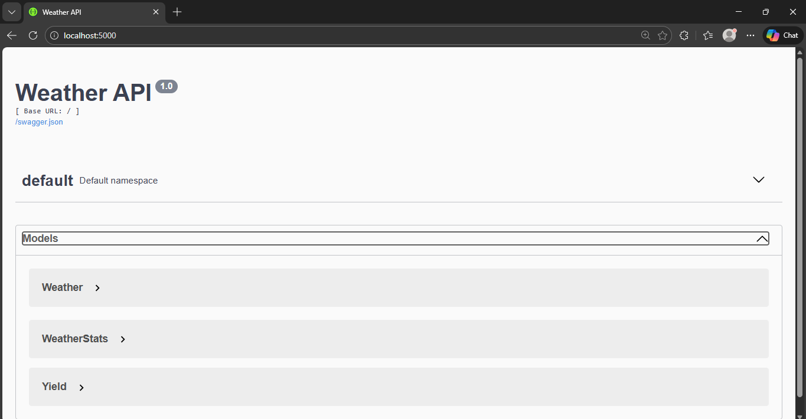
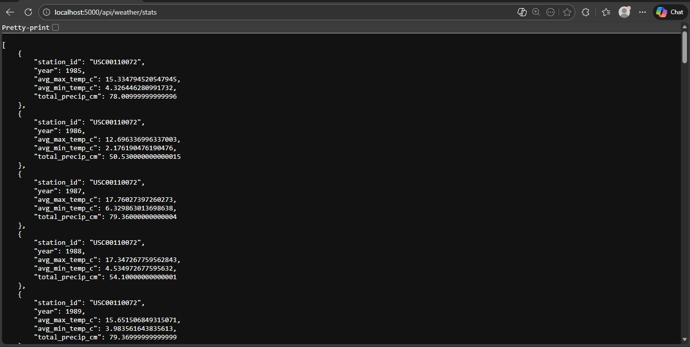
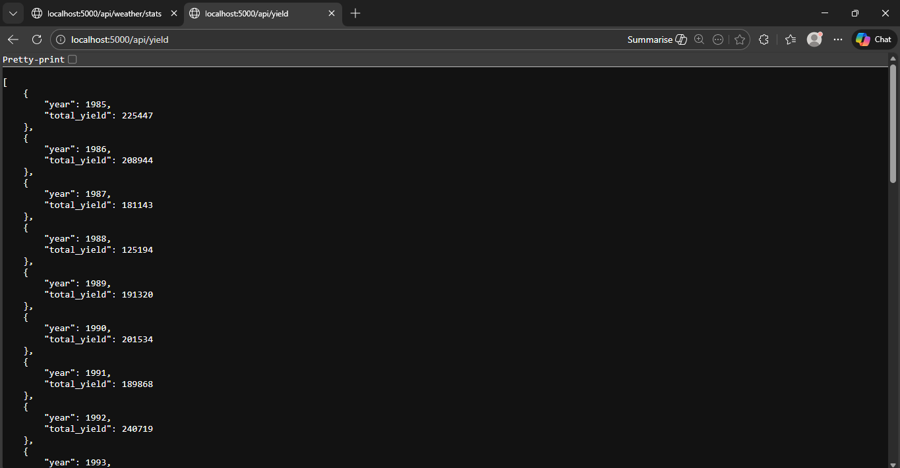

# Weather & Crop Yield Data API

## Overview

This project ingests historical weather data and US corn grain yield data, stores it in a SQLite database, computes yearly weather statistics, and exposes all data via a REST API with Swagger documentation.

The project demonstrates:

* Data ingestion and cleaning
* Database modeling with SQLAlchemy
* REST API design using Flask + Flask-RESTX
* Automatic API documentation via Swagger
* Progress bars for large data ingestion

---

## Directory Structure

```ini
.
├── app.py              # Flask API with models and endpoints
├── ingest.py           # Data ingestion and statistics calculation
├── wx_data/            # Weather data files (txt)
├── yld_data/           # Corn yield data file
├── weather.db          # SQLite database (generated)
└── README.md          # Project documentation
```

---

## Setup

1. **Install dependencies**:

```bash
pip install flask flask-restx flask-sqlalchemy tqdm
```

2. **Run data ingestion**:

```bash
python ingest.py
```

* Shows progress bars for weather files, yield data, and stats calculation
* Populates `weather.db`

3. **Run the API**:

```bash
python app.py
```

* Accessible at `http://localhost:5000/`
* Swagger UI provides interactive documentation

---

## API Endpoints

| Endpoint             | Description                                   | Query Parameters                                            |
| -------------------- | --------------------------------------------- | ----------------------------------------------------------- |
| `/api/weather`       | Returns weather records                       | `station_id`, `start_date`, `end_date`, `page`, `page_size` |
| `/api/weather/stats` | Returns yearly weather statistics per station | `station_id`, `year`, `page`, `page_size`                   |
| `/api/yield`         | Returns corn yield per year                   | None                                                        |

---

## Example Queries

* Weather for station `USC00110072` in Jan 1985:

```ini
http://localhost:5000/api/weather?station_id=USC00110072&start_date=1985-01-01&end_date=1985-01-31

```

* Stats for station `USC00110072` in 1985:

```sh
http://localhost:5000/api/weather/stats?station_id=USC00110072&year=1985
```

* All corn yield data:

```sh
http://localhost:5000/api/yield
```

---

## Screenshots

1. **Swagger UI**



2. **Weather Endpoint Example**


3. **Weather Stats Endpoint Example**



4. **Yield Endpoint Example**



---

## Running Locally

1. Ensure Python 3.10+ is installed
2. Clone the repository and navigate to the project folder
3. Install dependencies (`pip install -r requirements.txt`)
4. Run `python ingest.py` to populate the database
5. Run `python app.py` to start the API
6. Open `http://localhost:5000/` in the browser to explore Swagger

